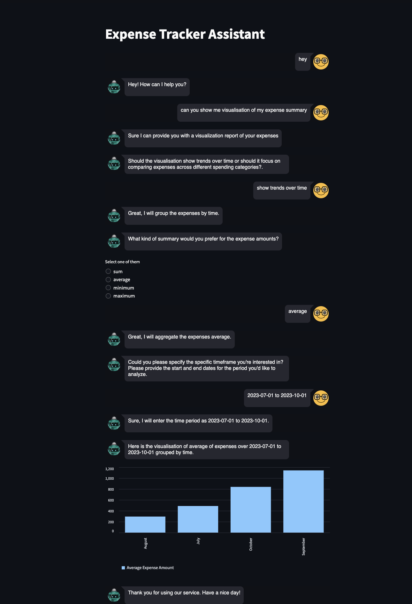

# Expense Tracker Chatbot  


[](https://github.com/Pallavi-Sinha-12/Expense-Tracker-Chatbot/stargazers)
[](https://github.com/Pallavi-Sinha-12/Expense-Tracker-Chatbot/watchers)
[](https://github.com/Pallavi-Sinha-12/Expense-Tracker-Chatbot/forks)

Expense Tracker Chatbot is an innovative project that combines the power of natural language processing and data visualization enabling users to track their expenses. It is built using the RASA framework and hosted on Streamlit and uses Azure SQL Database to store and manage expense data. The chatbot is designed to be user-friendly and intuitive, making it easy for users to enter expenses and request visual reports. It also provides a sample website that integrates the chatbot through a toggle button. This project is a good example of how you can create a conversational AI chatbot to track your expenses and deploy it on a website running on a different server.

## Table of Contents

- [Technologies-Used](#Technologies-Used)
- [Things Chatbot Can Do?](#Things-Chatbot-Can-Do?)
- [Features](#Features)
- [Set up your development environment](#Set-up-your-development-environment)
- [Install Project Locally](#Install-Project-Locally)
- [Database Setup](#Database-Setup)
- [Interact with Chatbot](#Interact-with-Chatbot)
- [Demo](#Demo)
- [Project Structure](#Project-Structure)
- [Authors](#Authors)
- [License](#License)
- [Contributing](#Contributing)
- [Feedback](#Feedback)
- [Contact](#Contact)
- [References](#References)


## Technologies-Used

[](https://www.python.org/)
[](https://rasa.com/)
[](https://www.streamlit.io/)
[](https://pandas.pydata.org/)
[](https://pypi.org/project/pyodbc/)
[](https://azure.microsoft.com/)


## Things-Chatbot-Can-Do?

- **Expense Entry Made Simple**: Tell the chatbot you want to enter an expense, and it will guide you through the process step by step. It will just ask you to provide the spending category, the amount, and the date.
- **Visualize Your Finances**: Want to see how your money flows? Ask the chatbot for visual reports. The chatbot would ask if you want to see the trends over time or comparing expenses by spending categories. It would then ask you to choose the aggregation method and time period for the report. It will then display an interactive bar chart with the requested information. 

## Features


Our Expense Tracker Chatbot project leverages a range of technologies and features to provide a seamless and user-friendly expense tracking experience. Here are some of the key technical features:

### 1. Natural Language Processing (NLP)

- **RASA Framework**: The chatbot is built using the RASA framework, which employs NLP techniques to understand and respond to user messages naturally. It understand user intent and extract relevant information from messages to provide meaningful responses.

### 2. Database Integration

- **Azure SQL Database and Key Vault**: We use an Azure SQL database to store and manage expense data. We use Azure Key Vault to securely store the database credentials. The chatbot uses the pyodbc library to connect to the database and perform CRUD operations.

### 3. Streamlit Web Interface

- **Streamlit Chat interface**: The chatbot interface is hosted using Streamlit, a Python library for creating web applications with minimal effort. A user-friendly chat interface is created using the Streamlit library.

### 4. Data Visualization

- **Streamlit Visualisations**: The streamlit library is used to create interactive bar charts that display expense trends over time or by spending category with a selected aggregation method over a specified time period.

### 5. User-Friendly Interaction

- **Intuitive Dialog Flow**: The chatbot engages users in an intuitive conversation, guiding them to enter expense details or request visual reports effortlessly.

### 6. Data Analysis

- **Data Aggregation**: Users can choose from various aggregation options (e.g., sum, average) when requesting expense reports, enabling insightful analysis.

### 7. Date formats Handling

- **Date Parsing**: The chatbot can parse dates in various formats, making it convenient for users to enter expenses with their preferred date format. It handles dates like (05/10/2023, 2023/10/05, 05-10-2023, 2023-10-05, 05-10-2023, 2023-10-05, 05.10.2023, 2023.10.05, today, yesterday, day before yesterday, tomorrow, day after tomorrow ,this week, last week, this month, last month, this year, last year)

### 8. Sample Website Integration

- **Website Integration**: We provide a chatbot embedded sample website. This shows a good example of how chatbot can be embedded on a website running on different server. Users can access the chatbot by clicking chatbot icon on the website

## Set-up-your-development-environment

Before you begin, make sure you install the following :bulb: -

- Python 3.10
- Git
- Visual Studio Code

You need to take Azure subscription to use Azure SQL Database and Azure Key Vault. You can create a free Azure account [here](https://azure.microsoft.com/en-us/free/).

## Install-Project-Locally

Clone the project

```bash
  git clone https://github.com/Pallavi-Sinha-12/Expense-Tracker-Chatbot
```

Go to the project directory

```bash
  cd Expense-Tracker-Chatbot
```

Create virtual environment and activate

```bash
  python3 -m venv ./venv
  source ./venv/bin/activate
```

Install packages

```bash
  pip install -r requirements.txt
```

## Database-Setup

### 1.  Install Azure CLI

Install Azure CLI on your local machine. You can follow the [official documentation](https://docs.microsoft.com/en-us/cli/azure/install-azure-cli?view=azure-cli-latest) to install Azure CLI. You can login to Azure CLI using the command `az login`.

### 2. Create Azure SQL Database

Create an Azure SQL Database using Azure CLI or Azure Portal. Make sure you note down the database name, server name, username and password. You will need these details to connect to the database. You can follow the [official documentation](https://learn.microsoft.com/en-us/azure/azure-sql/database/single-database-create-quickstart?view=azuresql&tabs=azure-portal) to create an Azure SQL Database.

### 3. Create Azure Key Vault

For saving secrets, we will create an Azure Key Vault. You can follow the [official documentation](https://docs.microsoft.com/en-us/azure/key-vault/general/quick-create-portal) to create an Azure Key Vault.

### 4. Store Database Credentials in Azure Key Vault

Store the database password in Azure Key Vault. You can follow the [official documentation](https://docs.microsoft.com/en-us/azure/key-vault/secrets/quick-create-portal) to store the database password in Azure Key Vault. Make sure you note down the secret name. You will need this detail to retrieve the database credentials.

### 5. Create Azure SQL Database Table

Go to you Azure Portal and create table names `dbo.expense`. Add columns `category`, `amount`, `date` in the table.

### 6. Create Azure SQL Database Table Columns

Create an Azure SQL Database table columns using Azure CLI. You can also create it using Azure Portal. Make sure you note down the column names. You will need this detail to connect to the database.

### 7. Add client IP to Azure SQL Database Firewall

Add your client IP to Azure SQL Database Firewall. Go on Azure Portal, click on overview of your Azure SQL Database, click on Set server firewall. Add your client IP to the firewall and save it. For further details, you can follow the [official documentation](https://docs.microsoft.com/en-us/azure/azure-sql/database/firewall-configure?tabs=azure-portal).

### 8. Install the ODBC Driver for connecting to Azure SQL Database

Install the `Microsoft ODBC Driver 17` for connecting to Azure SQL Database. You can follow the [official documentation](https://docs.microsoft.com/en-us/sql/connect/odbc/download-odbc-driver-for-sql-server?view=sql-server-ver15) to install the ODBC Driver.

### 9. Add your Database Credentials to DatabaseConfig.py

Replace the `SQL_DATABASE_SERVER_NAME`, `SQL_DATABASE_NAME`, `SQL_DATABASE_USERNAME`, `KEY_VAULT_URL`, `SQL_DATABASE_PASSWORD_SECRET_NAME` in `database/DatabaseConfig.py` with your database credentials.

## Interact-with-Chatbot

Train RASA chatbot with data

```bash
  rasa train
```

After you have trained the chatbot, you can run it on your local machine. The model can be found in the `models` directory. To interact in command line, run:

```bash
  rasa shell
```
By default, RASA uses the latest trained model. If you want to use a specific model, you can specify it using the `--model` flag. For example, to use the model trained on 2023-10-05-12-00-00, you can run:

```bash
  rasa shell --model models/20231005-120000.tar.gz
```

### Run-the-chatbot-on-localhost

**Terminal 1** : Run RASA server on localhost

```bash
  rasa run --enable-api
```
This will start the RASA server on localhost. The default port is 5005. The RASA server will be used by the RASA actions endpoint and the RASA chatbot streamlit application. This may take a minute to start. Once the server is started, follow the next steps.

**Terminal 2** : Run RASA actions endpoint in other terminal

```bash
  rasa run actions
```

**Terminal 3** : Run RASA chatbot streamlit application

```bash
  streamlit run Expense-Tracker-Chatbot.py
```
You can now interact with the bot on streamlit chat interface. You can access the chatbot on your browser at http://localhost:8501.

### Interaction-with-chatbot-on-a-chatbot-embedded webpage

The chatbot is deployed on a sample website which is running on different server.

**Terminal 4** : Run the chatbot embedded website on localhost

```bash
  cd website
  python -m http.server -d .
```
Go to your localhost . Default port - 8000
You will be able to see a chatbot icon at the bottom of the webpage. You can click on it to interact with the chatbot, and clicking on it again will close the chatbot interface.

## Demo

Let's see how our Expense Tracker Chatbot works.

### 1. Expense Entry

Let's say you want to enter an expense. You can tell the chatbot that you want to enter an expense. The chatbot will then ask you to provide the spending category, the amount, and the date one by one. The chatbot will ask you to confirm the details before submitting the expense. If you confirm, the chatbot will submit the expense and provide a confirmation message. If you want to cancel the expense entry, you can tell the chatbot to cancel the expense entry. The chatbot will then cancel the expense entry and provide a confirmation message.

Below are some screenshots of how you can enter an expense using our Expense Tracker Chatbot.

 

### 2. Visual Reports

Let's say you want to see how your money flows. You can ask the chatbot for visual reports. The chatbot would ask if you want to see the trends over time or comparing expenses by spending categories. It would then ask you to choose the aggregation method and time period for the report. It will then display an interactive bar chart with the requested information.

The following screenshots show how you can request visual reports using our Expense Tracker Chatbot.

 

### 3. Chatbot Embedded Website

You can also access the chatbot on a sample website that integrates the chatbot using an iframe. You can access the chatbot on your browser at http://localhost:8000. You will be able to see a chatbot icon at the bottom of the webpage. You can click on it to interact with the chatbot, and clicking on it again will close the chatbot interface.

Below is the demo of a sample website that integrates our Expense Tracker Chatbot.


### 4. Full Demo

You can watch full demo [here](https://drive.google.com/file/d/1gHLhFs5gNAH4Gb6VOfkZCx6hKgPprnnI/view?usp=sharing)


## Project-Structure

- `data/nlu.yml` - It contains structured example user utterances. This usually includes the user's intent and any entities their message contains.
- `data/rules.yml` - This contains the training data used to train the assistant's dialogue management model. Rules describe short pieces of conversations that should always follow the same path.
- `data/stories.yml` - This contains stories which is used to train models that are able to generalize to unseen conversation paths.
- `actions/actions.py` - This file contains custom action classes that define how the bot should respond to user inputs.
- `domain.yml` - The domain file defines the actions, intents, entities, responses, and templates that the assistant can use.
- `endpoints.yml`: Specifies the endpoints for your custom action server and NLU model server.
- `models/` - After training, Rasa stores model files in this directory.
- `config.yml` - Contains training configurations for the NLU pipeline and policy ensemble
- `Expense-Tracker-Chatbot.py` - This is the main script for our Expense Tracker Chatbot's user interface. This Python script uses the Streamlit library to create an interactive and user-friendly interface for the chatbot.
- `requirements.txt` - This file specifies the Python dependencies required to run the project.
- `database/` - This folder contains the necessary files to connect to the Azure SQL Database to submit and retrieve expense data.
- `database/azure_key_vault.py` - This Python script uses the Azure Key Vault library to retrieve the database password from Azure Key Vault.
- `database/DatabaseConfig.py` - This Python script contains the database configuration details.
- `database/SQLQuery.py` - This Python script creates SQL Query to retrieve expense data for displaying visual reports based on user's request.
- `database/SQLDatabase.py` - This Python script uses the pyodbc library to connect to the Azure SQL Database and contains functions to insert and retrieve expense data.
- `models/` - After training, Rasa stores model files in this directory. This folder is created when you train the chatbot.
- `data_exporter/CSVFile.py` - This Python script contains functions to export data for requested visual report to a CSV file.
- `data_exporter/exports` - This folder contains the CSV files exported for requested visual reports. This folder is created when you request a visual report.
- `website/` - This folder contains the necessary files to host a simple website that integrates our Expense Tracker Chatbot using an iframe. This web interface is a good example of how you can host embed your chatbot in a website running on different server.
- `website/index.html` - The main HTML file of the website. It provides the structure and content of the webpage. It includes an embedded iframe for the chatbot.
- `website/styles.css` - The Cascading Style Sheets (CSS) file that defines the visual styles and layout of the webpage. It ensures the chatbot icon and iframe are displayed correctly.
- `website/script.js` - A JavaScript file that adds interactivity to the webpage. It handles the behavior of the chatbot icon, allowing users to toggle the chatbot iframe.
- `assets/` - This folder contains the images and GIFs used in this README file.
- `.gitignore` - This file specifies which files and directories should be ignored by Git.
- `README.md` - A README file explaining necessay things about this project.

## Authors

- [@Pallavi-Sinha-12](https://github.com/Pallavi-Sinha-12)

## License

The project is licensed under [MIT License](https://choosealicense.com/licenses/mit/)

## Contributing

Contributions are always welcome!

If you find any issue or have suggestions for improvements, please submit them as Github issues or pull requests.

Here are some ideas for future enhancements to this project:

- [ ] Use environment variables to store database credentials.
- [ ] Add support for chatbot to ask expense details in one go if user wants to enter expense.
- [ ] Improve chatbot's natural language understanding to handle more complex utterances for expense report requests.
- [ ] Add support of other SQL databases like MySQL, PostgreSQL, etc.
- [ ] Deploy the chatbot to production.
- [ ] Support for other visualizations like pie charts, line charts, etc.
- [ ] Implement personalized user expense tracking.
- [ ] Add data export functionality to download expense reports.
- [ ] Create a mobile app version for on-the-go expense tracking.
- [ ] Support for dates like (5th Oct 2023, 5th October, 5th Oct, 5 Oct 2023, 5 October, 5 oct, 5 OCT 2023)
- [ ] Make this project as generic so that people can add their own data and intents to customize it for their own use cases. 

Feel free to contribute or provide feedback on any of these ideas! Not only that, please feel free to suggest your own ideas as well.


## Feedback

If you liked the project support it by giving a star :star:

Feel free to send me feedback at pallavisinha95829@gmail.com. Let me know if you have any suggestions on how to make this project better.


## 🔗 Contact
[](https://www.linkedin.com/in/pallavi-sinha-09540917b/)[](https://github.com/Pallavi-Sinha-12)


## References

- Rasa: Open source conversational AI. URL: https://rasa.com

- Streamlit: The fastest way to build custom ML tools. URL: https://streamlit.io

- Azure SQL Database. URL: https://azure.microsoft.com/en-us/services/sql-database/

- Azure Key Vault. URL: https://azure.microsoft.com/en-us/services/key-vault/

- Azure CLI. URL: https://docs.microsoft.com/en-us/cli/azure/?view=azure-cli-latest
